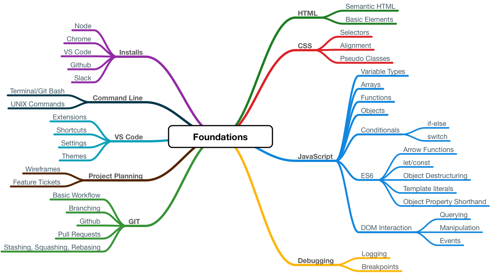

# Book 1 - Foundations

In this book, you will build a strong foundation of skills and practices that will serve you throughout the course, and the entirety of your career as a software developer. Once complete, you will be ready to begin your initiation into the world of modern development - using all the tools and libraries that are popular today.

You will learn not only the basics of coding, design, and teamwork skills, but you will also unlock the secrets and power of your computer, making it bend to your will. Your computer is the instrument of the craft, and to become a true professional, you must have proficiency and knowledge of it.

## Learning Objectives

## Chapters
* #### Chapter 1 - Setup
  * [Setup/Installs](./chapters/setup.md)
* #### Chapter 2 - Tooling
  * [VS Code](./chapters/vs_code.md)
  * [Command Line Basics](./chapters/command-line.md)
* #### Chapter 3 - Github
  * [Git and Github](./chapters/git-and-github.md)
  * [Git Branching](./chapters/git-branching.md)
* #### Chapter 4 - HTML and CSS
  * [HTML](./chapters/HTML.md)
  * [CSS](./chapters/css.md)
  * [HTML and CSS Tooling](./chapters/HTML-CSS-Tooling.md)
* #### Chapter 5 - JavaScript
  * [ES6 vs. ES5](./chapters/es6-vs-es5.md)
  * [Functions](./chapters/js-functions.md)
  * [Strings](./chapters/js-strings.md)
  * [Objects](./chapters/js-objects.md)
  * [Arrays and Looping](./chapters/js-array-looping.md)
  * [Arrays Methods](./chapters/js-array-methods.md)
* #### Chapter 6 - Other
  * [Github Projects](./chapters/github-projects.md)
  * [Chrome Dev Tools & Debugging](./chapters/dev-tools.md)
  * [Wireframes](./chapters/wireframes.md)
  * [Markdown](./chapters/markdown.md)
* #### Chapter 7 - Interaction with the DOM
  * [The DOM](./chapters/dom.md)
  * [JS Events](./chapters/js-events.md)
  * [Dynamic Event Listeners](./chapters/dynamic-events.md)
