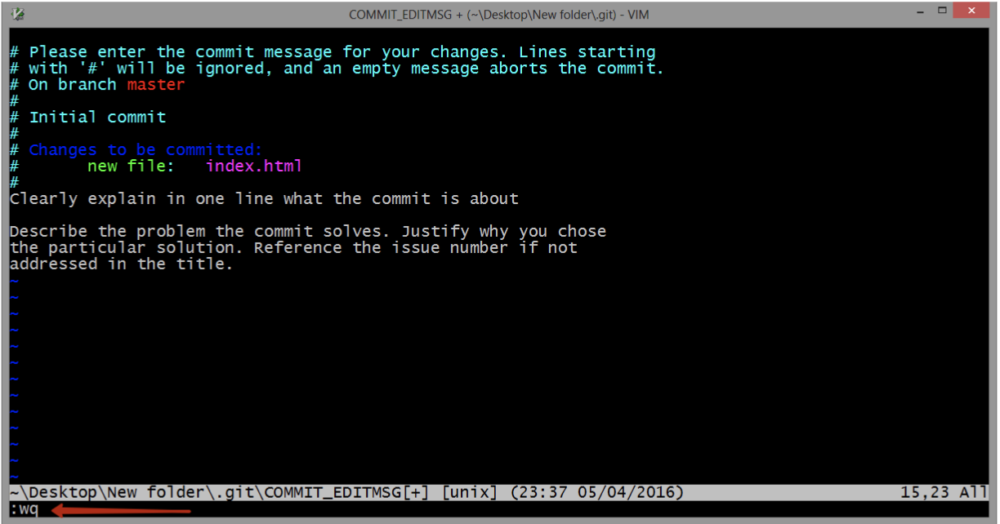
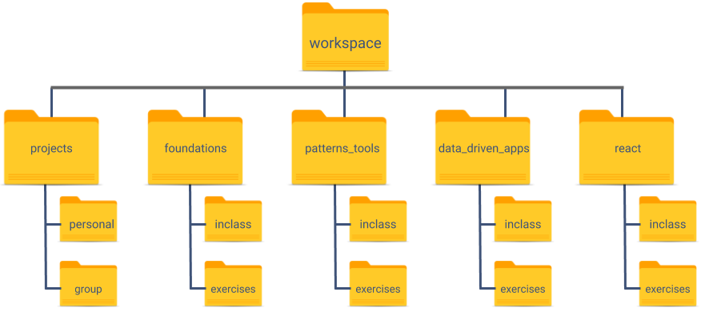

# Command Line Basics

## Introduction
The command line is a text based interface that allows you to control your computer.  You can use it to navigate your machines file structure and perform commands that you can't using just your computers file explorer.

## Tools
* __Mac Users__:  You will be using an application called [Terminal](https://support.apple.com/guide/terminal/welcome/mac).  If you want another option that has some slightly flashier looking display take a look at [iTerm2](https://www.iterm2.com/)
* __Windows Users__:  You will be using [Windows Terminal](https://www.microsoft.com/en-us/p/windows-terminal-preview/9n0dx20hk701) with an Ubuntu Shell/tab. This'll get you into a unix-like envrionment, which'll have match all the commands for a Mac or Linux machine you may run across.

## Why you need to know it
* __Control:__ Edit permissions, see hidden files, execute powerful commands (example:  running a project as an administrator)
* __Package Control:__ Install and interact with applications that have no other user interface (example: installing http-server)
* __Tasks Runners:__ Various processors that will aid in development (example: grunt, gulp, or webpack)
* __Server control:__ Create scripts that control other machines (example: writing a script that deploys your code or getting logs from another server)

You will be using the command line EVERY day in this class.

## Rule #1 of Command Line:
__Always know where you are__ `pwd`

## Common Commands (Unix Based)
For all these commands `>` indicates a code block and `#` indicates a comment.  To run each command type everything after the `>` but before the `#`.
1. Print Working Directory - print working directory; show where you are.

    ```>  pwd```

2. Change Directory - use this to change what folder you are in

    ```>  cd .. #this goes back one directory```

    ```>  cd ~ #this goes back to the root of your machine```

    ```>  cd ../cookies #this goes back one directory and then into a folder called cookies```

3. Make a New Directory - creates a new folder

    ```>  mkdir bananas #this makes a folder called bananas in whatever location you are currently in```

4. Create a new file - create a new file

    ```>  touch index.html #this makes a files named index.html in your current location```

5. list directory - lists all the files/folders in the directory you are currently in

    ```>  ls #lists current files/folders```

    ```>  ls -a #lists current files included hidden files/folders```

    ```>  ls -al #lists current files included hidden files/folders the long way```

6. Move a file/filter - this moves things where you want them

    ```>  mv index.html bananas/index.html #move index.html into the bananas folder```

7. Copy a file or directory

    ```>  cp index.html ./cat.html  #make a copy of index.html and call it cat.html in this same folder```

8. Deleting files/folders - delete file/folder this can't be undone

    ```> rm cat.html  # removes the cat.html file```
    ```> rm -rf cookies  # removes the cookies folder and everything inside it```

    :exclamation: WARNING: :exclamation:

    This command will delete your ENTIRE computer DON'T RUN IT

    ```> rm -rf *(SERIOUSLY DON'T RUN THIS.)```


9. Open stuff in finder window - see things in the finder window

    Mac: ```>  open . # opens current folder in Finder window```

    Windows: ```>  explorer . # opens current folder in Explorer window```

10. Learn more about command line via command line - open terminal help

    Mac: ```>  man mv # opens terminal manual about mv command```

    Windows: ```> mv --help # opens terminal manual about mv command```

11. Open stuff in VS Code

    ```>  code . #opens the current directory in VS code.```

## VIM
If you see this don't panic:

We will talk more about this in a few weeks but for now follow these steps:
* hit escape
* type `:wq`
* hit enter

## Tree
Tree is a super helpful command line tool that lets you see all the sub directories or sub files of a particular folder.  To install it:

Mac: ```>  brew install tree```

Windows: ```> cmd //c tree```

Once it is installed use it by going to the directory you are interested in exploring and then typing `tree` and hitting enter.

## Mini Challenge: Create our Class File Structure
For the next six months we will be working through four different milestones.  In order to make that go smoothly lets create a file structure so we are all coding in the same place.  To test what you have learned above lets see if you can create our file structure.

* Step 1: Run this command `mkdir ~/workspace`
* Step 2: Run this command `cd ~/workspace`
* Step 3: The above two command should have made a workspace directory at the root of your machine and take you into that folder. Now create all the subfolders we will need:

