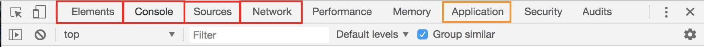

# Chrome Dev Tools

Dev tools ⚡super-charge⚡ your ability to customize your web applications and investigate how your code is working. You should **always** have your dev tools open. 👀

Your dev tools contain a wealth of information. But no need to be overwhelmed! You will use some dev tool panels more than others. The red boxes will be most used in this class.

## Three Ways to Open
1. Shortcut Keys (opens to network panel OR console panel):
    - Mac: `CMD + OPT + I` OR `CMD + OPT + J`
    - Windows: `CTRL + SHIFT + I` OR `CTRL + OPT + J` OR `F12`
1. Right Click
    - Right click on the screen and select inspect. Takes you to that HTML element.
1. Menu
    - Chrome Menu > More Tools > Developer Tools

## Your Most Important Panels

### Elements Panel
- Inspect and live-edit the HTML and CSS on the page
  - See the full dom tree and navigate it one element at a time
  - View ALL CSS rules applied to a specific element
  - See what CSS rules have been overridden
  - Modify CSS rules in real time

### Console Panel
- Fast JS Playground, console holder, test values
  - JS in the browser - type in any JS and watch it go
  - Any console.logs you put in print here
  - When you have stopped your code execution (see [Debugging](#debugging)), you can print out the values of your javascript variables here.
  - PRO TIP: You can toggle the JS console pane while in other panels by clicking `esc`.

### Sources Panel
- Where the pros debug their code. (again, see [Debugging](#debugging))
  - Allows you to open any JS/CSS file and see the code in it
  - You can place breakpoints so you don’t need to put in debuggers/console.logs
  - At each breakpoint you can see what variables are in your DOM

### Network Panel
- Shows you the status of all assets (HTML, CSS, JS) you try and load into the site
  - Shows all assets that were requested
  - Gives you load times on each resource
  - Gives you status of each source
  - Gives detailed information API requests and API responses (more on this later in the course).

### Application Panel
- Where the cookies live
  - View and edit things in local/session storage
  - View and edit cookies
  - View and edit Application Cache

## Additional Resources
- Read the Chrome Dev Tools [Documentation](https://developers.google.com/web/tools/chrome-devtools/)

----

## Debugging Your Code in the Browser

There are three main methods for debugging code your code in the browser.
1. `console.log`
1. `debugger;`
1. Breakpoints

### console.log

The `console.log()` method in JavaScript allows you to display any information you want in the Console tab of the browser.

As you start to write more advanced javascript code, you will find that sometimes the variables that you `console.log` will lie to you. If you think that is happening, you should try using one of the other two options.

### debugger

The `debugger;` keyword stops the execution of your javascript code - it allows you to review your JS code and see what the values of variable are at that moment. Below, I put in a `debugger` statement so that I can see what is contained inside the colors array, and then I can step one line of code at a time and see how the `colors` variable changes.

### Breakpoints

Breakpoints are debugger statements that are set in the Dev tools Sources Panel, not in your code.
  - Pros:
    - You are not changing your code. Note: it is *very* bad practice to commit code that has `debugger;` or `console.log()` statements
    - You can manage your breakpoints more easily in your dev tools:
      - You can disable all of your breakpoints
      - You can see your breakpoints listed out
  - Cons:
    - Breakpoints can sometimes take longer to set up
