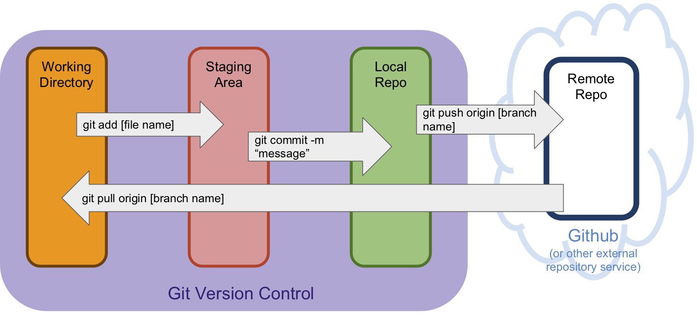

# Git and Github
## What is difference between Git and Github?
* __Git:__ allows you to keep track of changes made to your code.  it is the most widely used version control software out there.  It is considered a modern development standard.  Sometimes it si referred to as distributed version control - this means work is done on a local computer and then pushed to the remote source of truth.
* __GitHub:__ This is a web-based utility that hosts/stores Git Repository information.  It makes team collaboration easy.  It also is a record of what you have done at NSS - all your code is tracked and timestamped.  Looking at your GitHub over the course of 12 months will tell employers how you have grown.

## Git Terms
* __Repository (repo):__ folder that contains your source code
* __master:__ the branch where the source code is the most complete. On creation, your local repository will always be on the master branch.
* __local:__ - refers to your personal machine. ‘Local changes’ are modifications that you have made and committed, but have not pushed to an external store (for us, Github).
* __remote:__ refers to the remote servers/machines that store changes and allow for those changes to be pulled down/cloned onto another’s machine.

## Basic Git Flow:


## Basic Git Commands
* Initalize repo - this lets your computer know that you will be using git to track files in the folder. It starts your git history and creates a .git folder wherever you run it.

  ```> git init```
* Clone repo - this is how you pull down an existing repository.  We will discuss this when you get to your first group project.

* Get git status - this tells you what has changed in your repository since the last time you committed.  This will be your favorite command

  ```> git status```
* See git differential - this tells you what has changed in a file

  ```> git diff index.html```
* Add files to git - allows you to individually add files you want to package up

  ```> git add index.html```
* Commit files to git - allows you to package up all the things you added and take a snapshot.  You should add a meaningful message to your commit.

  ```> git commit -m "added in a navbar"```
* Get git log - allows you to see the last couple commits you have made.  change the number after the dash to control how many you see.

  ```> git log -3```
* Push to remote - pushes any commits you have made up to your remote (in our case up to github).  With this command you specify what branch you are pushing to.

```> git push origin master```

## How to Push a Simple Repository to GitHub
1. Make a folder locally with a readme file in it
```sh
> cd ~/workspace/foundations/inclass
> mkdir test
> touch README.md
> code .
```
2. put some text in the README.md file and save
3. Make a new repository on github called test
4. Connect the folders and push using the information provided
```sh
> git init
> git add README.md
> git commit -m "first commit"
> git remote add origin git@github.com:zoeames/cow.git
> git push -u origin master
```
