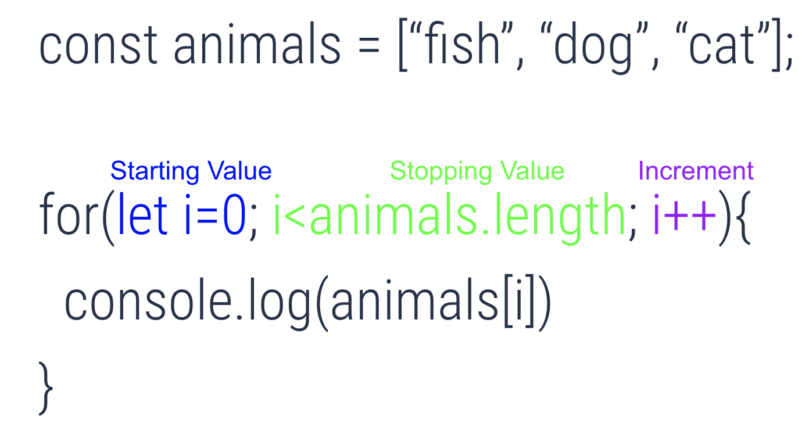

# Javascript Arrays
Arrays are like buckets of stuff where the order matters.  For example if we take a bucket and fill it with cats we should always know the order of the cats in the bucket;  something like:
```js
const cats = ['fluffy', 'spike', 'Mr. Whiskers', 'killer'];
```
The majority of the tasks you will accomplish in this course and in your dev career will involve looping over an array of objects and displaying that data to the DOM.

### For Loops
For loops allow you to do the same thing over and over again even when you don't know how many times you need to do something.  When you need to use a for loop you need to know the following:
1.  What value to start at
1. What value to stop at
1. How to increment
Once you know those three things you can translate what you know in the loop by putting the right thing in the right spot:

