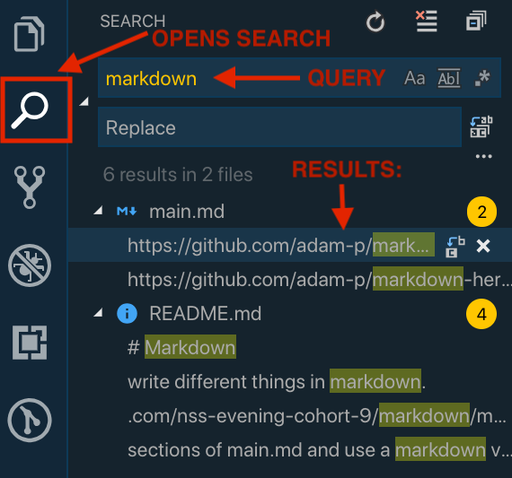
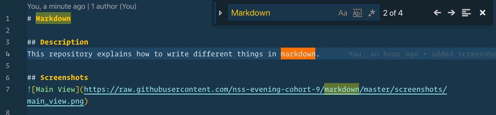
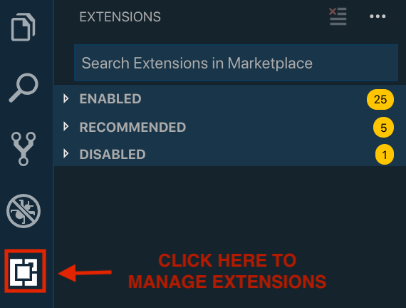

# VS Code
VS Code is a free and open source text editor built by Microsoft.  It is extremely customizable and will allow you to easily write code.  You will use it ALL DAY EVERY DAY.

## Installation
You should already have this installed on your computer from the first day of class.  In case something ever goes wrong with your installation here are the instalation instructions again:
### Mac Users
Mac users will install VS Code via homebrew:
```sh
brew cask install visual-studio-code
```
### Windows Users
Windows users will install VS code via the download link on their [Website](https://code.visualstudio.com/).

## Seaching in VS
There are two ways to search for things in VS Code.  Use the right method for the job you are trying to complete:
1.  Global Search
Use this when you are trying to find all occurances of some text in ANY file in your open project.

To open the global search click the magnifying glass icon on the left navigation bar.  Then type in the text you want to search for and hit enter.  For example I typed in `markdown` and two files came back with that text:




2. Local Search
Use this when you are trying to find any occurances of some text in the current file you are in.

* Mac Users: `CMD + F`
* Windows Users: `CTR + F`

This will open a small textbox in the upper right corner of the window where you can type in some text.  Every occurance of the text you type will become highlighted.  Here is an example of looking for the word `markdown` in a file:



## Extensions
Extensions are what make VS code so popular and easy to use.  There are thousands of different plugins for everything you can imagine.  Most of them are written to make development easier and more efficent.

To install or manage your extensions go to the extension tab by clicking on the extension icon in the left navigation bar.  Once the extension tab is open you can search the marketplace for extensions and install or uninstall them.




## Extensions to Install
Here are some good extensions to get your productivity going. Search for these names in the extension tab and click install to get them working.

1.  [Auto Rename Tag](https://github.com/formulahendry/vscode-auto-rename-tag) - when you decide to rename an html tag this plugin automatically fixes the closing tag for you.
2. [Bracket Pair Colorizer](https://github.com/CoenraadS/BracketPair) - this extension matches pairs of brackets and colors them for you.  Next time you are looking for a missing curly bracket or parenthesis just look for the one that doesn't have a closing tag of the same color
3. [ESLint](https://github.com/Microsoft/vscode-eslint) - This extension checks your code for common errors using ESLint.  We will talk more about this a few months into class.
4. [GitLens](https://github.com/eamodio/vscode-gitlens) - Gives you insignt into what git stuff is going on inside your project.  You can see things like when the line was last modified and who modified it.
5. [IntelliSense for CSS class names in HTML](https://github.com/Zignd/HTML-CSS-Class-Completion) - Autocompletes HTML and CSS for any file that has been linked.  Never type those whole bootstrap class names again.
6. [Markdown Preview Github Styling](https://github.com/mjbvz/vscode-github-markdown-preview-style) - changes VS Code's built in markdown preview to match the Github flavor.  Know exactly what those README files will look like before you push them.
7. [Prettier - Code Formatter](https://github.com/prettier/prettier-vscode) - formats JS and CSS code inside a file.