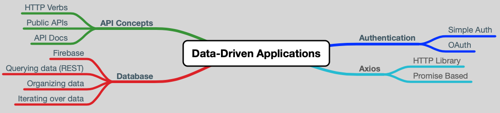

# Book 3 - Data-Driven Applications

## Chapters
* Chapter 1 - [APIs](https://github.com/nss-nightclass-projects/Night-Class-Resources/blob/master/book-3-data-driven-applications/chapters/APIs.md)
* Chapter 2 - [Task Runners](./chapters/task-runners.md)
* Chapter 3 - [Axios](https://github.com/nss-nightclass-projects/Night-Class-Resources/blob/master/book-3-data-driven-applications/chapters/webpack%2Bimages%2Baxios.md)
* Chapter 4 - firebase
    * [Deploying with Firebase](https://github.com/nss-nightclass-projects/Night-Class-Resources/blob/master/book-3-data-driven-applications/chapters/firebase-deploy.md)

## Learning Objectives

