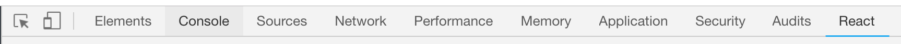

# Intro to React
Now that we have created our repo using create-react-app and modified the file structure to fit our needs, its time to take a deeper look at what we have and how things work.

## What is class?/What is constructor?
- A constructor: special javascript object that has functions and properties defined on it.
- A class: this is essentially fancy function - ok article [here](https://medium.com/javascript-scene/javascript-factory-functions-vs-constructor-functions-vs-classes-2f22ceddf33e)

## Class Syntax
- `class App extends React.Component`: Gives our App class extra methods from the React.Component (i.e. render method)
- Aids us by setting the initial state (for lack of a better word) for our components.
- How do classes differ from functions?
  - `this`: In vanilla js, `this` references the execution context of the function. With arrow functions, `this` refers to lexical scope.
    > hold up, I don't fully understand all that. answer, that's okay! for using this in the above situations, just throw in a `console.log(this)` to see what you have.
  - IN REACT, `this` refers to the context of your class. You will be using it a LOT.

## Why we are not using constructors?
tldr; ES6+
[Great Article](https://hackernoon.com/the-constructor-is-dead-long-live-the-constructor-c10871bea599)

## How to translate a constructor based class to what we are doing?

what is JSX

fancy function - ok article [here](https://medium.com/javascript-scene/javascript-factory-functions-vs-constructor-functions-vs-classes-2f22ceddf33e)
## Why we are not using constructors?
tldr; ES6+
[Great Article](https://hackernoon.com/the-constructor-is-dead-long-live-the-constructor-c10871bea599)

## How to translate a constructor based class to what we are doing?

> A Note on Imports: You will import React into every component file that you write

## JSX
Things to know:
- You must always have one main container (one parent tag) for all of the tags created.
- We will write JSX to be returned from our component's render method. Multi-line JSX can be written if you include parenthesis around the JSX:
```javascript
render() {
  // zoe's preference on what can go here: helper functions that manipulate what is going to go to the DOM
  return (
    <div className="GreetingComponent">
      <h1>Hello World!</h1>
    </div>
  )
}
```
Parenthesis are not needed if you are returning only one line of JSX.

## Adding a basic click event within a component
- add an `onClick={this.clickEventFunction}` attribute to which you want to add the click event.
- clickEventFunction (or whatever you want to name it) would be defined on the class as a function
```javascript
class Chart extends React.Component {
  clickEventFunction = (e) => {
    // code goes here for what should trigger after the click event
  }

  render() {  {/* Put JSX here */}  }
}
```


## Chrome Extension
- Install the extension [React Developer Tools](https://chrome.google.com/webstore/detail/react-developer-tools/fmkadmapgofadopljbjfkapdkoienihi?hl=en). This will show up in your **dev tools** in the top bar (but only when you are viewing a website that is using react)

