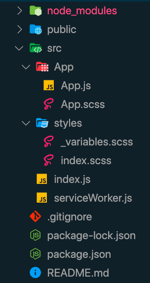

# Move files for better organization
`create-react-app` throws all the files at the root of src.  Thats nice until you have components and then its gets real crowded fast.  Lets fix that.

### Create App Folder
All the App stuff should be in a folder together
1. Create `src/App` and move App.js and App.scss into there.
2. Modify App import statement in index.js =  `import App from './App/App';`
3. Delete `logo.svg`
4. In App.js remove logo import statement and image tag

### File Structure
Your file structure should now look like this:

[Return to Instructions](../react-setup.md)